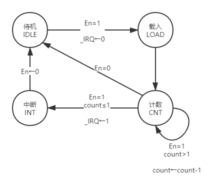
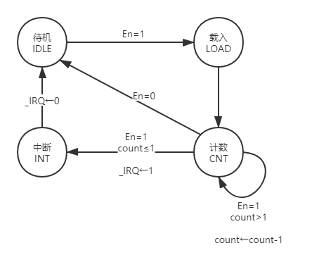

# 2023秋P7·MIPS微系统设计文档

## Part 1 设计草稿

### 1.1 总体概述
以下是参考的结构图：


#### 1.1.1 CPU类型
CPU为**五级流水线MIPS - CPU**，目前由**Verilog**的**ISE**工具链实现。

#### 1.1.2 微系统结构
- CPU  
CPU包含**IFU、GRF、CMP、EXT、ALU、DM、MUDI_Processor、Controller、CP0、各级之间的流水线寄存器**等多个模块**以及冒险处理单元**。   
> `MUXs.v`文件集成了4个多路选择器。  
> `forward_MUXs.v`可以看作是冒险处理单元的附属模块，集成了转发机制需要的所有多路选择器。
  
- 系统桥  
独立的**Bridge模块**，负责沟通CPU和外设。

- 外设   
目前的外设是**官方提供的Timer0、Timer1两个计时器**。外置的DM、IM和抽象出来的中断发生器也应该看作是外设。

#### 1.1.3 CPU支持的指令集
为了测试开发方便，本次设计将完全支持**MIPS-C3指令集**。对该指令集按照**方便于冒险的解决模式**进行分类如下：  
- **calr**类型指令  
{**add addu sub subu and or xor nor sll sllv sra srav srl srlv slt sltu**}    
- **cali**类型指令  
{**lui ori addi addiu andi xori slti sltiu**}  
- **calmudi**（乘除计算）类型指令    
{**mult multu div divu**}    
- **readhl**（读乘除寄存器）类型指令  
{**mflo mfhi**}   
- **writehl**（写乘除寄存器）类型指令   
{**mthi mtlo**}  
- **jump1**类型指令    
{**jr jalr**}    
- **jump2**类型指令    
{**j jal**}  
- **branch**类型指令  
{**beq bgtz blez bgez bltz bne**}
- **load**类型指令    
{**lw lb lbu lh lhu**}  
- **store**类型指令    
{**sw sb sh**}  
- **nop**类型指令  
{**nop**}  
- **p7新增指令**  
{**mtc0 mfc0 eret syscall**}  

> 注：部分指令行为与指令集中不同，以教程要求为准。  

### 1.2 模块设计

> 注：**CP0模块完全按照教程设计，这里不再展示**。  

#### 1.2.1 IFU

> 本模块**IM**部分外置，因此内部细节与接口定义较之前有小范围改动。  

##### 1.2.1.1 端口定义
|   端口名    | 方向  | 位宽  |                                             信号描述                                              |
| :---------: | :---: | :---: | :-----------------------------------------------------------------------------------------------: |
|     clk     |   I   |   1   |                                             时钟信号                                              |
|    reset    |   I   |   1   |                          同步复位信号，复位使PC的值为0x3000（起始地址）                           |
|   enable    |   I   |   1   |                      使能信号，当enable为1时，IFU开始工作；否则，IFU停止工作                      |
|  branchEn   |   I   |   1   |             来自CMP部件的输出结果，1表示满足某1种branch型指令的跳转条件，0表示不满足              |
|   offset    |   I   |  16   |                                            跳转偏移量                                             |
| instr_index |   I   |  26   |                                           跳转目标地址                                            |
|    rsIn     |   I   |  32   |                                          GRF[rs]读出的值                                          |
|  D_pcPlus4  |   I   |  32   |                                      D阶段(译码阶段)的pc+4值                                      |
|   jumpOp    |   I   |   3   | 跳转操作类型：000，无跳转；001，branch（beq/bgtz/blez/bgez/bltz/bne）；010；jal/j；011，jr/jalr； |
|    ReqM     |   I   |   1   |                               CP0模块输出的进入异常处理程序请求信号                               |
|    eretD    |   I   |   1   |                          D阶段识别是否是eret指令的结果（要回到原程序处）                          |
|    EPC_f    |   I   |  32   |                            经过选择的EPC值（原程序开始继续执行的地址）                            |
|     pc      |   O   |  32   |                               PC值，用于显示当前指令的地址(按字节)                                |
> 在本文档中，形如`D_xxx`的信号表示该信号是输入信号且来自D阶段，形如`xxx_D`的信号表示该信号是输出信号且送往D阶段。对于其他阶段也是如此。  
> 该部分被分为**pc、npc、im三个子模块**,本设计将其写在同一个文件中，用注释区分。  

##### 1.2.1.2 功能定义
- 同步复位
  - 当reset为1时，将PC的值置为0x3000（起始地址）
- 计算下一条指令地址（调整PC值）
  - 当branch（beq/bgtz/blez/bgez/bltz/bne）指令有效时（branchEn == 1 && jumpOp == 001），PC = PC + 4 + offset * 4
  - 当j/jal指令有效时（jumpOp == 010），PC = pc[31:28] || instr_index || 00  
  - 当jr/jalr指令有效时（jumpOp == 011），PC = rsIn
  - 否则，PC = PC + 4 
- 取指令
  - 根据PC的值，从IM中读出下一条指令nInstr 

#### 1.2.2 IF_ID(流水线寄存器)

##### 1.2.2.1 端口定义
|  端口名   | 方向  | 位宽  |           信号描述            |
| :-------: | :---: | :---: | :---------------------------: |
|    clk    |   I   |   1   |           时钟信号            |
|   reset   |   I   |   1   |         同步复位信号          |
|  enable   |   I   |   1   |           使能信号            |
|   F_pc    |   I   |  32   |     F级（取指阶段）的pc值     |
| F_nInstr  |   I   |  32   |   F级（取指阶段）的nInstr值   |
|  F_BDIn   |   I   |   1   | F级指令是否是延迟槽指令的信号 |
| F_excCode |   I   |   5   |         F级异常状态码         |
|   pc_D    |   O   |  32   |     D级（译码阶段）的pc值     |
| pcPlus4_D |   O   |  32   |    D级（译码阶段）的pc+4值    |
| pcPlus8_D |   O   |  32   |    D级（译码阶段）的pc+8值    |
| nInstr_D  |   O   |  32   |   D级（译码阶段）的nInstr值   |
|  BDIn_D   |   O   |   1   |  指令是否是延迟槽指令的信号   |
| excCode_D |   O   |   5   |         D级异常状态码         |


##### 1.2.2.2 功能定义
- 暂存F阶段结果，向D阶段提供数据。

#### 1.2.3 GRF

> 本模块原本的**display语句**也转移至外置文件中。  
 
##### 1.2.3.1 端口定义
| 端口名 | 方向  | 位宽  |               信号描述               |
| :----: | :---: | :---: | :----------------------------------: |
|  clk   |   I   |   1   |               时钟信号               |
| reset  |   I   |   1   |             同步复位信号             |
|   WE   |   I   |   1   | 写使能信号：1，允许写入；0，不可写入 |
|   A1   |   I   |   5   |           读出数据的地址1            |
|   A2   |   I   |   5   |           读出数据的地址2            |
|   A3   |   I   |   5   |            写入数据的地址            |
|   WD   |   I   |  32   |               写入数据               |
|  RD1   |   O   |  32   |              读出数据1               |
|  RD2   |   O   |  32   |              读出数据2               |

##### 1.2.3.2 功能定义
- 读数据
  - 读数据1：根据地址A1，读出对应的数据RD1
  - 读数据2：根据地址A2，读出对应的数据RD2
- 写数据
  - 写数据：WE为1、reset不为1且时钟上升来临时，根据地址A3，写入数据WD
  - 会按照教程所要求格式输出写入信息
- 同步复位
  - 当reset为1时，将所有寄存器清零

#### 1.2.4 CMP

##### 1.2.4.1 端口定义
|   端口名   | 方向  | 位宽  |                                                      信号描述                                                      |
| :--------: | :---: | :---: | :----------------------------------------------------------------------------------------------------------------: |
|     A      |   I   |  32   |                                                 第一个操作数（A）                                                  |
|     B      |   I   |  32   |                                                 第二个操作数（B）                                                  |
| branchType |   I   |   3   | D级控制器输出的branch类型指令的具体类别：000，none；001，beq；010，bgtz；011，blez；100，bgez；101，bltz；110；bne |
|  branchEn  |   O   |   1   |                                         某种branch类型指令是否达到跳转条件                                         |

##### 1.2.4.2 功能定义
- 判断
  - 判断A和B是否满足某个具体的条件，满足时branchEn为1，不满足时branchEn为0

#### 1.2.5 EXT

##### 1.2.5.1 端口定义
| 端口名  | 方向  | 位宽  |                  信号描述                  |
| :-----: | :---: | :---: | :----------------------------------------: |
| dataIn  |   I   |  16   |            输入数据,16位立即数             |
|  extOp  |   I   |   2   | 扩展操作类型：00，无符号扩展；01，符号扩展 |
| dataOut |   O   |  32   |            输出数据,32位立即数             |

##### 1.2.5.2 功能定义
- 位扩展
  - 将16位的立即数扩展为32位的立即数，提供符号扩展、无符号扩展两种方式

#### 1.2.6 ID_EX(流水线寄存器)

##### 1.2.6.1 端口定义
|  端口名   | 方向  | 位宽  |           信号描述           |
| :-------: | :---: | :---: | :--------------------------: |
|    clk    |   I   |   1   |           时钟信号           |
|   reset   |   I   |   1   |         同步复位信号         |
|  enable   |   I   |   1   |           使能信号           |
| D_nInstr  |   I   |  32   |       D阶段的nInstr值        |
|   D_pc    |   I   |  32   |         D阶段的pc值          |
| D_pcPlus4 |   I   |  32   |        D阶段的pc+4值         |
| D_pcPlus8 |   I   |  32   |        D阶段的pc+8值         |
|   D_RD1   |   I   |  32   | D阶段从rs寄存器读出的数据RD1 |
|   D_RD2   |   I   |  32   | D阶段从rt寄存器读出的数据RD2 |
| D_dataOut |   I   |  32   | D阶段的扩展后的立即数dataOut |
|  D_BDIn   |   I   |   1   |  指令是否是延迟槽指令的信号  |
| D_excCode |   I   |   5   |        D级异常状态码         |
| nInstr_E  |   O   |  32   |       E阶段的nInstr值        |
|   pc_E    |   O   |  32   |         E阶段的pc值          |
| pcPlus4_E |   O   |  32   |        E阶段的pc+4值         |
| pcPlus8_E |   O   |  32   |        E阶段的pc+8值         |
| rsData_E  |   O   |  32   | E阶段的从rs寄存器读出的数据  |
| rtData_E  |   O   |  32   | E阶段的从rt寄存器读出的数据  |
| extImm_E  |   O   |  32   | E阶段的扩展后的立即数extImm  |
|  BDIn_E   |   O   |   1   |  指令是否是延迟槽指令的信号  |
| excCode_E |   O   |   5   |        E级异常状态码         |

##### 1.2.6.2 功能定义
- 暂存D阶段结果，向E阶段提供数据。

#### 1.2.7 ALU

##### 1.2.7.1 端口定义
|  端口名  | 方向  | 位宽  |                                                                                                                信号描述                                                                                                                 |
| :------: | :---: | :---: | :-------------------------------------------------------------------------------------------------------------------------------------------------------------------------------------------------------------------------------------: |
|    A     |   I   |  32   |                                                                                                              第一个操作数                                                                                                               |
|    B     |   I   |  32   |                                                                                                              第二个操作数                                                                                                               |
|  shamt   |   I   |   5   |                                                                                                                移位位数                                                                                                                 |
|  aluOp   |   I   |   4   | ALU操作类型：0000，加；0001，减；0010，按位与；0011，按位或；0100，异或（xor）；0101，或非（nor）； 0110，逻辑左移；0111，逻辑右移；1000，算数右移；1001，按无符号数相比小于； 1010：按有符号数相比小于 1011：低16位加载到高位且低位补0 |
|    R     |   O   |  32   |                                                                                                                运算结果                                                                                                                 |
| overflow |   O   |   1   |                                                                                                             是否溢出的信号                                                                                                              |
##### 1.2.7.2 功能定义
- ALU操作类型：
  - 0000，加；  
  - 0001，减；  
  - 0010，按位与；  
  - 0011，按位或；  
  - 0100，异或（xor）；  
  - 0101，或非（nor）；   
  - 0110，逻辑左移；  
  - 0111，逻辑右移；  
  - 1000，算数右移；  
  - 1001，按无符号数相比小于；   
  - 1010：按有符号数相比小于；   
  - 1011：低16位加载到高位且低位补0  

#### 1.2.8 EX_MEM(流水线寄存器)

##### 1.2.8.1 端口定义
|   端口名   | 方向  | 位宽  |           信号描述            |
| :--------: | :---: | :---: | :---------------------------: |
|    clk     |   I   |   1   |           时钟信号            |
|   reset    |   I   |   1   |         同步复位信号          |
|   enable   |   I   |   1   |           使能信号            |
|  E_nInstr  |   I   |  32   |        E阶段的nInstr值        |
|    E_pc    |   I   |  32   |          E阶段的pc值          |
| E_pcPlus4  |   I   |  32   |         E阶段的pc+4值         |
| E_pcPlus8  |   I   |  32   |         E阶段的pc+8值         |
|  E_aluRes  |   I   |  32   |   E阶段的ALU运算结果aluRes    |
|  E_rtData  |   I   |  32   |  E阶段的从rt寄存器读出的数据  |
|  E_extImm  |   I   |  32   |  E阶段的扩展后的立即数extImm  |
| E_hiloData |   I   |  32   | E阶段的从乘除寄存器读出的数据 |
|   E_BDIn   |   I   |   1   |  指令是否是延迟槽指令的信号   |
| E_excCode  |   I   |   5   |         E级异常状态码         |
| E_overflow |   I   |   1   |       E级的overflow信号       |
|  nInstr_M  |   O   |  32   |        M阶段的nInstr值        |
|    pc_M    |   O   |  32   |          M阶段的pc值          |
| pcPlus4_M  |   O   |  32   |         M阶段的pc+4值         |
| pcPlus8_M  |   O   |  32   |         M阶段的pc+8值         |
|  aluRes_M  |   O   |  32   |   M阶段的ALU运算结果aluRes    |
|  rtData_M  |   O   |  32   |  M阶段的从rt寄存器读出的数据  |
|  extImm_M  |   O   |  32   |  M阶段的扩展后的立即数extImm  |
| hiloData_M |   O   |  32   | M阶段的从乘除寄存器读出的数据 |
|   BDIn_M   |   O   |   1   |  指令是否是延迟槽指令的信号   |
| excCode_M  |   O   |   5   |         M级异常状态码         |
| overflow_M |   O   |   1   |       M级的overflow信号       |

##### 1.2.8.2 功能定义
- 暂存E阶段结果，向M阶段提供数据。

#### 1.2.9 DM

> 本模块**main_dm**部分外置，因此内部细节与接口定义较之前有小范围改动。  
 
##### 1.2.9.1 端口定义
|    端口名    | 方向  | 位宽  |                                   信号描述                                    |
| :----------: | :---: | :---: | :---------------------------------------------------------------------------: |
|     clk      |   I   |   1   |                                   时钟信号                                    |
|    reset     |   I   |   1   |                                 同步复位信号                                  |
|      WE      |   I   |   1   |                     写使能信号：1，允许写入；0，不可写入                      |
|      RE      |   I   |   1   |                     读使能信号：1，允许读出；0，不可读出                      |
|   storeOp    |   I   |   2   | store型指令具体类别：00，sw（存整字）；01，sh（存半字）；10，sb（存一个字节） |
|    loadOp    |   I   |   3   |       load型指令具体类别：000，lw；001，lbu；010，lb；011，lhu；100，lh       |
|      A       |   I   |  32   |                读写地址：输入值是按字节为单位；容量是4096字；                 |
| m_data_rdata |   I   |  32   |              外置dm读出的32位原始数据（需要经过load_helper处理）              |
|      RD      |   O   |  32   |                             经过处理后的读出数据                              |
| writeBytesEn |   O   |   4   |                                字节写使能信号                                 |
> 本模块为了适应多种类型的存取指令进行了扩展，共分为**store_helper、main_dm、load_helper**三个子模块，写在同一个文件中，用注释区分。  
> **store_helper**主要功能是根据具体的某条store指令要求，通知**main_dm**写数据的具体位置。  
> **load_helper**主要功能是根据具体的某条load指令要求，从**main_dm**取出正确格式的数据。  

##### 1.2.9.2 功能定义
- 读数据
  - 读数据：RE为1时且时钟上升来临时，根据地址A，读出数据RD;否则读出0。
- 写数据
  - 写数据：WE为1时且时钟上升来临时，根据地址A，写入数据WD；否则保持原值。
  - 会按照教程所要求格式输出写入信息
- 同步复位
  - 当reset为1时，将所有内容清零

#### 1.2.10 MEM_WB(流水线寄存器)

##### 1.2.10.1 端口定义
|   端口名   | 方向  | 位宽  |           信号描述            |
| :--------: | :---: | :---: | :---------------------------: |
|    clk     |   I   |   1   |           时钟信号            |
|   reset    |   I   |   1   |         同步复位信号          |
|   enable   |   I   |   1   |           使能信号            |
|  M_nInstr  |   I   |  32   |        M阶段的nInstr值        |
|    M_pc    |   I   |  32   |          M阶段的pc值          |
| M_pcPlus4  |   I   |  32   |         M阶段的pc+4值         |
| M_pcPlus8  |   I   |  32   |         M阶段的pc+8值         |
|  M_aluRes  |   I   |  32   |   M阶段的ALU运算结果aluRes    |
|  M_rtData  |   I   |  32   |  M阶段的从rt寄存器读出的数据  |
|  M_extImm  |   I   |  32   |  M阶段的扩展后的立即数extImm  |
|  M_dmData  |   I   |  32   |  M阶段的从DM读出的数据dmData  |
| M_hiloData |   I   |  32   | M阶段从乘除寄存器中读出的结果 |
|  M_CP0Out  |   I   |  32   |   M阶段从CP0模块读出的数据    |
|  nInstr_W  |   O   |  32   |        W阶段的nInstr值        |
|    pc_W    |   O   |  32   |          W阶段的pc值          |
| pcPlus4_W  |   O   |  32   |         W阶段的pc+4值         |
| pcPlus8_W  |   O   |  32   |         W阶段的pc+8值         |
|  aluRes_W  |   O   |  32   |   W阶段的ALU运算结果aluRes    |
|  rtData_W  |   O   |  32   |  W阶段的从rt寄存器读出的数据  |
|  extImm_W  |   O   |  32   |  W阶段的扩展后的立即数extImm  |
|  dmData_W  |   O   |  32   |  W阶段的从DM读出的数据dmData  |
| hiloData_W |   O   |  32   | W阶段从乘除寄存器中读出的结果 |
|  CP0Out_W  |   O   |  32   |   W阶段从CP0模块读出的数据    |

##### 1.2.10.2 功能定义
- 暂存M阶段结果，向W阶段提供数据。

#### 1.2.11 MUDI_Processor

##### 1.2.11.1 端口定义
| 端口名  | 方向  | 位宽  |                              信号描述                               |
| :-----: | :---: | :---: | :-----------------------------------------------------------------: |
|   clk   |   I   |   1   |                              时钟信号                               |
|  reset  |   I   |   1   |                            同步复位信号                             |
|    A    |   I   |  32   |                            第一个操作数                             |
|    B    |   I   |  32   |                            第二个操作数                             |
| mudiOp  |   I   |   3   | calmudi型指令的具体类型：000，mult；001，multu；010，div；011，divu |
|  start  |   I   |   1   |                              启动信号                               |
| hiRead  |   I   |   1   |                           hi寄存器读信号                            |
| loRead  |   I   |   1   |                           lo寄存器读信号                            |
| hiWrite |   I   |   1   |                           hi寄存器写信号                            |
| loWrite |   I   |   1   |                           lo寄存器写信号                            |
|   HI    |   O   |  32   |                             hi寄存器值                              |
|   LO    |   O   |  32   |                             lo寄存器值                              |
| mudiRD  |   O   |  32   |                            本次读出的值                             |
|  busy   |   O   |   1   |                            该部件忙信号                             |

##### 1.2.11.2 功能定义

- 根据具体指令类型，执行符号乘、无符号乘、符号除和无符号除。
- 根据具体指令类型，读写hi或lo寄存器

#### 1.2.12 Controller

> 在此前历次设计中，均采用了**指令驱动型**的译码方式，原因是这样**表达直观且易于理解**。但是现在C3指令集有50条指令，如果继续按照指令驱动会使代码篇幅过长。故本设计采用**控制信号驱动型**译码，并利用宏文件尽量使代码简洁易懂。  

##### 1.2.12.1 部分关键端口定义
|   端口名   | 方向  | 位宽  |                                                                                                                信号描述                                                                                                                 |
| :--------: | :---: | :---: | :-------------------------------------------------------------------------------------------------------------------------------------------------------------------------------------------------------------------------------------: |
|   nInstr   |   I   |  32   |                                                                                                                当前指令                                                                                                                 |
|     op     |   I   |   6   |                                                                                                                 操作码                                                                                                                  |
|     fn     |   I   |   6   |                                                                                                                 功能码                                                                                                                  |
|   regDst   |   O   |   2   |                                                                       寄存器堆写入地址选通信号：00，选用rt为地址写入；01，选用rd为地址写入；10，选用$ra为目标写入                                                                       |
|   aluSrc   |   O   |   1   |                                                                                 ALU第二个操作数（B）选通信号：1，选用立即数；0，选用寄存器堆读出的数据                                                                                  |
|   aluOp    |   O   |   4   | ALU操作类型：0000，加；0001，减；0010，按位与；0011，按位或；0100，异或（xor）；0101，或非（nor）； 0110，逻辑左移；0111，逻辑右移；1000，算数右移；1001，按无符号数相比小于； 1010：按有符号数相比小于 1011：低16位加载到高位且低位补0 |
|   memToR   |   O   |   3   |                                                               数据写入寄存器堆时的数据来源：000，来自ALU运算结果；001，来自DM；010，写入pc+4的值；011，来自hi或者lo寄存器                                                               |
|  memWrite  |   O   |   1   |                                                                                                 DM写使能信号：1，允许写入；0，不可写入                                                                                                  |
|  memRead   |   O   |   1   |                                                                                                 DM读使能信号：1，允许读出；0，不可读出                                                                                                  |
|  regWrite  |   O   |   1   |                                                                                              寄存器堆写使能信号：1，允许写入；0，不可写入                                                                                               |
|   extOp    |   O   |   2   |                                                                                               扩展操作类型：00，无符号扩展；01，符号扩展                                                                                                |
|   jumpOp   |   O   |   3   |                                                                    跳转操作类型：000，无跳转；001，branch（beq/bgtz/blez/bgez/bltz/bne）；010；jal/j；011，jr/jalr；                                                                    |
|   mudiOp   |   O   |   3   |                                                                                   calmudi型指令的具体类型：000，mult；001，multu；010，div；011，divu                                                                                   |
|   start    |   O   |   1   |                                                                                                            乘除部件启动信号                                                                                                             |
|   hiRead   |   O   |   1   |                                                                                                             hi寄存器读信号                                                                                                              |
|   loRead   |   O   |   1   |                                                                                                             lo寄存器读信号                                                                                                              |
|  hiWrite   |   O   |   1   |                                                                                                             hi寄存器写信号                                                                                                              |
|  loWrite   |   O   |   1   |                                                                                                             lo寄存器写信号                                                                                                              |
| branchType |   O   |   3   |                                                                   branch类型指令的具体类别：000，none；001，beq；010，bgtz；011，blez；100，bgez；101，bltz；110；bne                                                                   |
|  storeOp   |   O   |   2   |                                                                              store型指令具体类别：00，sw（存整字）；01，sh（存半字）；10，sb（存一个字节）                                                                              |
|   loadOp   |   O   |   3   |                                                                                    load型指令具体类别：000，lw；001，lbu；010，lb；011，lhu；100，lh                                                                                    |
|  isShamt   |   O   |   1   |                                                                                               原本rs处的值是否看作移位值（sll、srl、sra）                                                                                               |

##### 1.2.12.2 功能定义
- 控制信号生成
  - 识别指令的操作码和功能码，根据指令的不同，生成不同的控制信号

### 1.3 冒险单元设计

#### 1.3.1 总体思路
需要实现两个核心模块，**Haz_Decoder（冒险译码器）以及 Haz_Processor （冒险处理器）**。  
**冒险译码器**负责解析各个阶段指令的信息，**本设计采用分布式译码**，传递给冒险处理器来生成暂停和转发逻辑的信号。
> 解析的信息是：某个具体的指令属于**1.1.3分类中的哪一种（P7新增单独解析）**   
  
**冒险处理器**负责生成暂停和转发逻辑的信号，消除冒险现象。
> 根据策略表，确定哪些组合需要stall(S)信号，哪些组合需要对应的哪些转发数据。  
> `forward_MUXs`辅助其完成真正的数据转发。  

#### 1.3.2 Haz_Decoder 冒险译码器
**可以发现，这部分与Controller模块中对指令分类的部分代码近乎重合。这里就不再展示。这样节省了很多工作量，这也是在1.1.3中提出总分类标准的初衷与好处**。

#### 1.3.3 Haz_Processor 冒险处理器
另附上冒险单元处理表：  
> 说明：  
> **对于某一个指令的某一个数据需求，我们定义需求时间`Tu`**: 这条指令位于 D 级的时候，再经过多少个时钟周期就必须要使用相应的数据。beq的`Tu`为0；sw的`rs_Tu`为1，`rt_Tu`为2。  
> **对于某个指令的数据产出，我们定义供给时间`Tn`**:位于某个流水级的某个指令，它经过多少个时钟周期可以算出结果并且存储到流水级寄存器里。例如，对于 add 指令，当它处于 E 级，此时结果还没有存储到流水级寄存器里，所以此时它的`Tn`为1。  
> **递推公式：下一级的`Tn'`= max{`Tn`-1 ,0}**  

> 对于rt寄存器，mfc0与load类指令同等地位，这里省略不展示  

暂停策略表:  
    

转发策略表:  
    

## Part 2 测试方案

**基本方法**：
- 构造一段`MIPS`程序，输入`Mars`中运行；  
- 利用`Mars`导出机器码，形成`code.txt`文件，用来载入自己的cpu的IM中，仿真运行；  
- 比对两者按统一格式输出的内容。即如下两种格式：  
```verilog
//grf
$display("@%h: $%d <= %h", WPC, Waddr, WData);
//dm
$display("@%h: *%h <= %h", pc, addr, din);
```
> 注意:  
> 需要用到魔改版的`Mars`来获取标准的输出  
> 这里统一规定：对于0号寄存器的写入不进行输出  
> **P7开始，除了原程序，异常处理程序应该通过Mars命令行导入相应位置**    

以下谈谈测试数据应该如何生成。  

### 2.1 针对单指令功能的测试

#### 2.1.1 构造策略
这部分实现比较简单，可以用高级语言写一段程序，通过一些循环语句连续构造大量单种指令的序列。**对于branch型和jump型指令，可以单独划出跳转区进行构造，以防出现死循环**。

#### 2.1.2 示例代码
```mips
sub $27, $27, $15
sub $28, $28, $15
sub $29, $29, $15
sub $30, $30, $15
sub $31, $31, $15
ori $5, $0, 4
sw $0, 0($5)
sw $1, 4($5)
sw $2, 8($5)
sw $3, 12($5)
sw $4, 16($5)
# there can be more like this...
```

### 2.2 针对暂停和转发策略的测试

#### 2.2.1 构造策略
**根据自己的策略表，明确总共有哪些组合会出现冒险的情况**。列出所有的这些情况，逐个构造相应的测试程序，如下所示（下面没有完全列举）。

#### 2.2.2 示例代码
```mips
#beq cali
ori $1 $0 12
beq $1 $0 next2
ori $4 $0 1234
next2:addu $1 $1 $1

#beq load
ori $1 $0 12
sw $1 0($0)
lw $2 0($0)
beq $2 $0 next3
ori $4 $0 1234
next3:addu $1 $1 $1

#cal_r load
ori $1 $0 12
sw $1 0($0)
lw $2 0($0)
subu $3 $2 $1
```

### 2.3 中断异常&&综合测试
利用**1000行左右的测试程序**全面地测试所有的指令。在前面的文档中，已经各提供了一份详尽的代码，这里由于篇幅限制不再提供。

> 可以前往下一部分查看综合测试的部分性能指标。

#### 综合测试分析  
❗❗❗❗❗  
对于综合测试中2份千行级别代码，我使用了教程中的`Kernel - Pipeline`工具进行分析，大致结果如下：
1. 分析结果汇总
- test1
```cmd
standard pipeline-cycle: 1923
    slow pipeline-cycle: 2757
   accepted cycle range: [1756, 2506]
```
有效转发数：245      
有效暂停数：225

- test2
```cmd
standard pipeline-cycle: 1500
    slow pipeline-cycle: 2222
   accepted cycle range: [1355, 2005]
```
有效转发数：187      
有效暂停数：226

2. 本CPU仿真运行结果  
- test1:根据输出的`$time`值进行估计，周期数约为1934，性能良好可以接受。
- test2:根据输出的`$time`值进行估计，周期数约为1509，性能良好可以接受。

### 2.3 结论
**经对比内容一致，经分析性能良好，本测试通过，说明CPU的基本功能实现正确**。

## Part 3 思考题解答

- **请查阅相关资料，说明鼠标和键盘的输入信号是如何被 CPU 知晓的？**  

  鼠标和键盘产生信息，这些信息被读到内存或者CPU的寄存器中，产生中断信号，中断当前CPU的运行，CPU进入中断状态执行中断处理程序读入键盘和鼠标的信息进行处理。  

- **请思考为什么我们的 CPU 处理中断异常必须是已经指定好的地址？如果你的 CPU 支持用户自定义入口地址，即处理中断异常的程序由用户提供，其还能提供我们所希望的功能吗？如果可以，请说明这样可能会出现什么问题？否则举例说明。（假设用户提供的中断处理程序合法）**

  可以实现。但需要更改CPU中当出现异常或中断时要跳转到的异常处理程序地址，之后由用户提供的程序就可以对中断和异常进行处理。    
  但入口常常变动会导致该CPU的适用性降低，换个执行指令段执行可能就需要换个入口。  
  **因此最好的方案还是固定**。  

- **为何与外设通信需要 Bridge？**。
  
  外设数量庞大，每个外设都要针对CPU做单独处理那么时间与经济成本过于昂贵。利用Bridge，通过一个 CPU 视图下的内存地址，读写相应数据即可达到与外设沟通的目的，管理统一，拓展性强。  

- **请阅读官方提供的定时器源代码，阐述两种中断模式的异同，并分别针对每一种模式绘制状态移图。**
   
   **相同之处**：在允许计数的情况下，都是从初值寄存器中获取初数值到计数值寄存器中开始计数。      
   **不同之处**：**模式0**在计数结束后，会一直提供中断信号，直到IM或者EN被修改使其禁止中断或停止计数；**模式1**在计数结束后，只会提供一周期的中断信号，然后自动再次赋初值开始计数。  

   模式0如下图：
       
   模式1如下图：  
   

- **倘若中断信号流入的时候，在检测宏观 PC 的一级如果是一条空泡（你的 CPU 该级所有信息均为空）指令，此时会发生什么问题？在此例基础上请思考：在 P7 中，清空流水线产生的空泡指令应该保留原指令的哪些信息？**  

    会发生宏观PC出现0的情况，这显然是不合理的，所以应该保留原PC值。

- **为什么 jalr 指令为什么不能写成 jalr $31, $31？**  

    该寄存器的rs和rd不能相等，因为这样的指令在重新执行时不会有相同的效果。如果这样做了，假如延迟槽指令出现了异常，那么该异常是无法通过重新执行jalr来恢复执行的，因为$31寄存器的值已改变。